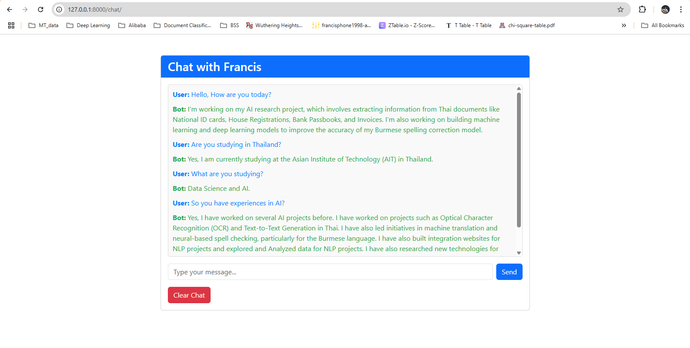

# Chat-With-Francis

This project implements a Retrieval-Augmented Generation (RAG) chatbot using the LangChain framework. The chatbot is designed to answer questions about the user (in this case, Phone Myint Naing) by retrieving information from relevant documents and generating responses using a language model.

## Features

- **Retrieval-Augmented Generation (RAG):** Combines document retrieval with language generation to provide accurate and context-aware responses.
- **Chat Interface:** A user-friendly web interface built with Django and Bootstrap.
- **Chat History:** Saves chat history in a database and displays it in the chat interface.
- **Loading Spinner:** Displays a loading spinner while the chatbot processes the user's input.
- **Clear Chat:** Allows users to clear the chat history.

## Requirements

- Python 3.8+
- Django 4.0+
- LangChain
- Hugging Face Transformers
- Bootstrap 5.3.0

## Installation

### Clone the Repository:

```bash
git clone https://github.com/FrancisPhone/NLP-A6-st124973.git
cd app
```

### Set Up a Virtual Environment:

```bash
python -m venv venv
source venv/bin/activate  # On Windows: venv\Scripts\activate
```

### Install Dependencies:

```bash
pip install -r requirements.txt
```

### Run Migrations:

```bash
python manage.py migrate
```

### Run the Django Server:

```bash
python manage.py runserver
```

### Access the Chat Interface:

Open your browser and go to [http://127.0.0.1:8000/chat/](http://127.0.0.1:8000/chat/).

## Usage

### Chat Interface:

- Type your message in the input box and click "Send."
- The chatbot will process your input and display the response in the chat box.

### Clear Chat:

- Click the "Clear Chat" button to clear the chat history.

## Retriever and Generator Models

### Retriever Model

- **Model:** HuggingFaceInstructEmbeddings
- **Description:** Used to create vector embeddings of the documents for efficient retrieval.
- **Source:** [https://huggingface.co/hkunlp/instructor-base]

### Generator Model

- **Model:** Fastchat-T5-3b
- **Description:** A text generation model used to generate responses based on the retrieved documents.
- **Source:** [https://huggingface.co/lmsys/fastchat-t5-3b-v1.0]

## Reference Documents

The chatbot retrieves information from the following documents:

- **Resume:** Contains personal information about Phone Myint Naing, including education, work experience, and skills.
- **Additional Documents:** Other relevant documents (e.g., personal blogs, LinkedIn profile) added to enhance the chatbot's knowledge.

## Folder Structure

```
your-repo-name/
├── app/
│   ├── templates/chatbot/
│   │   └── chat.html
│   ├── models.py
│   ├── views.py
│   ├── urls.py
│   └── ...
├── chatbot_project/
│   ├── settings.py
│   ├── urls.py
│   └── ...
├── requirements.txt
├── README.md
└── manage.py
```

## Deliverables

- **GitHub Repository:** Contains the Jupyter notebook, Django app, and README file.
- **Web Application:** A fully functional chatbot web application.
- **Question-Answer Pairs:** The chatbot can answer the following 10 questions:

  1. How old are you?
  2. What is your highest level of education?
  3. What major or field of study did you pursue during your education?
  4. How many years of work experience do you have?
  5. What type of work or industry have you been involved in?
  6. Can you describe your current role or job responsibilities?
  7. What are your core beliefs regarding the role of technology in shaping society?
  8. How do you think cultural values should influence technological advancements?
  9. As a master's student, what is the most challenging aspect of your studies so far?
  10. What specific research interests or academic goals do you hope to achieve during your time as a master's student?

  ## Demo
  
